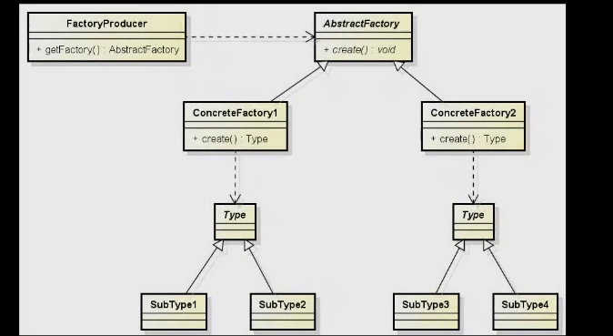

# Design Patter Abstract Factory

O Abstract Factory é um padrão de projeto de criação (creational pattern) que 
fornece uma interface para criar famílias de objetos relacionados ou dependentes
sem especificar suas classes concretas. Ele se enquadra na categoria de padrões 
de projeto creacionais, que tratam do processo de criação de objetos.
E muito parecido com o Factory Method, só que aqui a própria Factory é abstrata.

### Objetivo:

O objetivo principal do Abstract Factory é abstrair a criação de objetos de modo
que um sistema possa ser independente da forma como seus objetos são criados, 
compostos e representados. Ele ajuda a garantir que um conjunto de objetos 
criados juntos funcione bem entre si.

### Participantes:
    
   - FactoryProducer: Ele é responsável por criar fábricas concretas de acordo
   com algum critério ou contexto. O FactoryProducer é uma classe que abstrai a 
  escolha da fábrica concreta, com base em algum critério ou contexto, e retorna 
 a fábrica apropriada.

   - Abstract Factory (Fábrica Abstrata): Representa as factory que podemos criar.
    Define uma interface para a criação de objetos abstratos 
   (por exemplo, interfaces ou classes abstratas) que constituem 
   uma família de objetos relacionados. (SuperType de uma class) Veiculo - carro/moto.
   Além disso, temos o method [create()/newInstance()] que terá a responsabilidade de criar
   uma um objeto de um dos tipos dos Type/SuperType

  -  Concrete Factory (Fábrica Concreta): Implementa a interface da Abstract Factory ou herda (class)
    para criar objetos concretos da família. Cada Fábrica Concreta é responsável por 
    criar uma variante específica dos objetos que conhece (test é um), através do method create/newInstance que vem de
     Abstract Factory que retorna um Type/SuperType.

  -  Abstract Product/Type (Produto Abstrato/Type/SuperType): Definição do tipo mais generico. **Type** - Class modelo para os subTypes

  - Concrete Product/SubType (Produto Concreto): Implementa a interface do Produto Abstrato/Type,
  fornecendo uma implementação específica desse produto.

  -  Client (Cliente): Usa as interfaces declaradas pelo Abstract Factory para interagir 
    com os produtos criados. O cliente não precisa saber qual Concrete Factory está sendo
   usada, pois interage com os produtos apenas através de suas interfaces abstratas.
    ex: main.java

Vantagens:

   - Isolamento de Famílias de Produtos: O Abstract Factory isola as classes concretas que compõem uma família de produtos, garantindo que elas funcionem bem juntas. Isso facilita a substituição de famílias de produtos inteiras sem afetar o cliente.

   - Garantia de Consistência: O padrão ajuda a garantir que apenas objetos de uma família específica sejam criados. Isso reduz a chance de combinar objetos de famílias diferentes, o que pode causar incompatibilidades.

   - Configuração Flexível: O cliente pode ser configurado com uma Fábrica Concreta específica, permitindo que ele crie objetos compatíveis com essa família.

Desvantagens:

   - Complexidade: Introduz um nível adicional de abstração e complexidade no código, especialmente quando há muitos produtos e famílias de produtos.

   - Rigidez: A adição de novos tipos de produtos requer a extensão de todas as classes de fábrica, o que pode ser complexo