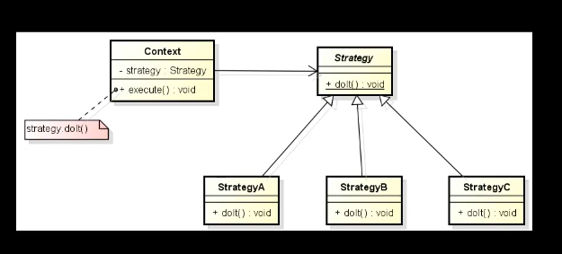

# Design Patter Strategy

O Design Pattern Strategy, também conhecido como Padrão de Estratégia, é um padrão de projeto de software
comportamental que permite definir uma família de algoritmos, encapsulá-los e torná-los intercambiáveis. 
Isso permite que o cliente escolha o algoritmo a ser utilizado em tempo de execução. Em outras palavras,
o Padrão Strategy é usado para definir um conjunto de algoritmos, encapsular cada um deles e torná-los 
substituíveis, permitindo que o cliente escolha qual algoritmo usar.

Vamos entender os principais componentes desse padrão:

    Contexto: É a classe que contém uma referência a uma estratégia específica. 
    O contexto geralmente não conhece os detalhes da implementação da estratégia. 
    Ele apenas delega a chamada ao método da estratégia.

    Estratégia: É uma interface ou classe abstrata que define um conjunto de métodos que
    todas as estratégias concretas devem implementar. Em outras palavras, a estratégia define
    o contrato que as estratégias concretas devem seguir.

    Estratégias Concretas: São implementações específicas das estratégias definidas na interface.
    Cada estratégia concreta fornece uma implementação diferente para o mesmo conjunto de métodos 
    definidos na estratégia.

Principais vantagens do Padrão Strategy:

    Flexibilidade: Permite que você altere o comportamento de um objeto em tempo de execução,
    selecionando uma estratégia diferente.

    Manutenção: Torna o código mais fácil de manter, uma vez que as estratégias são isoladas 
    e podem ser alteradas sem afetar o contexto.

    Reutilização: Estratégias diferentes podem ser reutilizadas em vários contextos.

Exemplo:

Vamos considerar um exemplo simples relacionado a processamento de pagamentos. Digamos que você 
esteja desenvolvendo um sistema de comércio eletrônico e deseje processar pagamentos. O Padrão 
Strategy pode ser usado para lidar com diferentes provedores de pagamento, como PayPal, cartão 
de crédito, boleto bancário etc. Cada provedor de pagamento seria uma estratégia concreta que 
implementa um método processPayment(). O contexto do sistema escolheria a estratégia apropriada 
com base no método de pagamento selecionado pelo cliente.

Isso permite que você adicione novos métodos de pagamento no futuro sem modificar o código existente 
do sistema, tornando-o mais flexível e extensível.

O Padrão Strategy é amplamente utilizado em muitas aplicações, especialmente quando há a necessidade
de lidar com múltiplas variações ou versões de um algoritmo. Ele promove o princípio do
"aberto/fechado" (open/closed), que significa que as classes são abertas para extensão, mas
fechadas para modificação, o que é um princípio fundamental na engenharia de software.