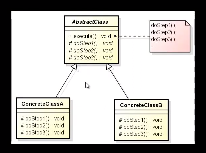

# Design Patter Template Method

O Design Pattern Template Method, ou Padrão de Método de Template em português, é um padrão de 
projeto comportamental que define a estrutura de um algoritmo em uma superclasse, mas permite que 
as subclasses alterem partes desse algoritmo sem mudar sua estrutura fundamental. Em outras palavras,
ele fornece um esqueleto de algoritmo com passos fixos, permitindo que partes do algoritmo sejam 
implementadas por subclasses.

Vamos entender os principais componentes deste padrão:

    Classe Abstrata (Abstract Class): Essa é a classe que define o esqueleto do algoritmo, incluindo
    os passos fixos. Os passos fixos são frequentemente implementados como métodos concretos na classe
    abstrata. Esses métodos são chamados de "métodos template" ou "hook methods". O método principal 
    que orquestra a execução do algoritmo é geralmente declarado como final, para evitar que as 
    subclasses o modifiquem. Esse é o "template method".

    Métodos Concretos: Esses são os métodos implementados pela classe abstrata, parte do algoritmo que
    não deve ser alterada por subclasses.

    Métodos Abstratos (Abstract Methods): Esses são os métodos declarados na classe abstrata, mas 
    sem implementação. Eles representam os pontos onde as subclasses devem fornecer sua própria
    implementação. Cada subclasse que herda da classe abstrata deve implementar esses métodos.

Principais vantagens do Padrão Template Method:

    Reutilização de código: Permite reutilizar o código comum nas classes filhas, evitando duplicação.
    Extensibilidade: Facilita a extensão de um algoritmo sem modificar sua estrutura.
    Encapsulamento: O algoritmo é encapsulado na classe abstrata, tornando-o mais organizado.

Exemplo:

Vamos considerar um exemplo comum relacionado a frameworks de desenvolvimento web. Suponha que
estamos desenvolvendo um framework de construção de páginas da web. O framework fornece uma classe 
abstrata chamada PageTemplate, que contém o esqueleto de uma página da web comum. A classe PageTemplate 
define os passos comuns, como header, content e footer. Cada uma dessas partes é implementada em métodos 
concretos da classe abstrata. No entanto, o conteúdo exato do header, content e footer pode variar dependendo
do tipo de página que estamos criando (por exemplo, uma página inicial, uma página de contato, uma página 
de blog).

Nesse cenário, as subclasses, como HomePage, ContactPage, BlogPage, herdam da classe PageTemplate e 
fornecem suas próprias implementações para os métodos abstratos correspondentes, como generateHeader(),
generateContent(), generateFooter(). Isso permite que cada tipo de página tenha seu próprio visual e
conteúdo personalizado, mas siga a estrutura geral definida na classe PageTemplate.

Assim, o Padrão Template Method facilita a criação de páginas da web personalizadas, mantendo a 
estrutura comum entre elas. É um exemplo clássico de como o Template Method é usado para definir o
esqueleto de um algoritmo que pode ser personalizado por subclasses.