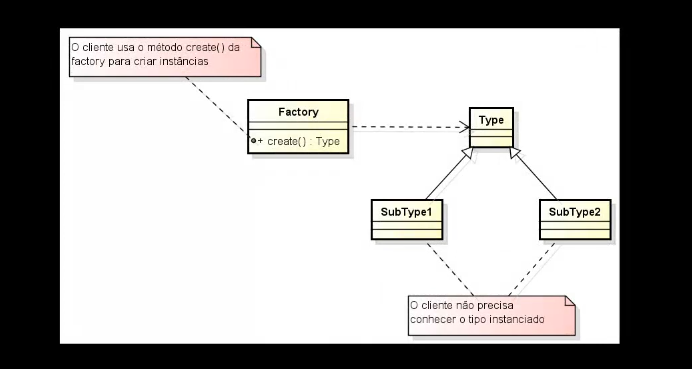

# Design Patter Factory Method

### **Factory Method** - Method que fabrica objetos (uma fábrica)

- **(Type)/SuperType** - Normalmente se trabalha com Interface ou classe
  abstrata que representará o Super Type - Modelo a se
  seguido/adotado **(Type)**.

- E temos sub-tipos **(subTypes)** que implementam(Interface) ou herdam(Class)
  de Type.

- E na **Factory** teremos um method **[create()/newInstance()]** que terá a responsabilidade de criar uma
  um objeto de um dos tipos dos subTypes existente, pois
  não podemos criar um objeto de **Type**. E então irá retornar esse
  objeto criado.

Permite o desacoplamento dos objetos, já que caso seja
necessário mudar a lógica do objeto retornado, iremos alterar somente no
SuperType, pois para quem está chamando o method,
não se importar com o real tipo do objeto criado.

## Objetivo:

- Definir uma interface/classe abstrata para a criação de um objeto, mas delega às suas
  subclasses definirem qual classe será instanciada.