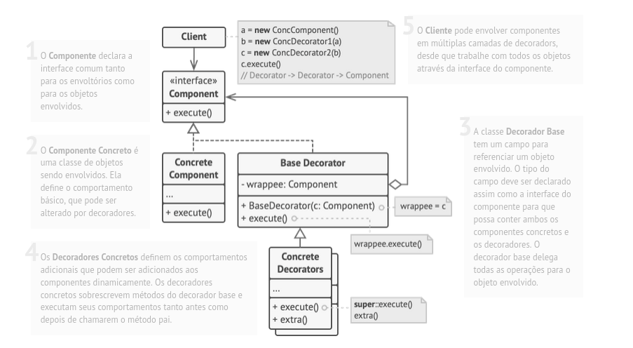

# Design Patter Decorator
Também conhecido como: Decorador, Envoltório, Wrapper

## Propósito

O padrão de projeto Decorator é um padrão estrutural que permite 
adicionar comportamentos adicionais a objetos de forma dinâmica. 
Ele é usado para estender as capacidades de um objeto sem criar uma
classe de subclasse para cada possível combinação de funcionalidade.
Isso é alcançado aninhando objetos em camadas, onde cada camada 
adiciona ou modifica um comportamento específico. 
(Encapsulamento de objetos)

## Estrutura
Estrutura do padrão de projeto Decorator

1. Componente (Component): Define a interface comum para todos os 
objetos que podem ser decorados. É a classe base para todos os 
componentes concretos. (Normalmente e uma Interface ou class abstrata)

2. Componente Concreto (Concrete Component): Implementa a interface 
do Componente ou herda se for class e representa o objeto que você 
deseja estender ou decorar, ou seja sobreescrever o comportamento do(s) method

3. Decorator (Decorator): É uma classe abstrata que também implementa a
interface do Componente. Ela contém uma referência a um objeto Componente
e atua como uma "casca" para os objetos Componente concretos. Ele pode 
adicionar funcionalidade adicional ao objeto Componente sem modificar sua estrutura.

4. Decorador Concreto (Concrete Decorator): São subclasses de Decorator que
adicionam funcionalidades específicas ao objeto Componente. Cada Decorador 
Concreto estende a classe abstrata Decorator e implementa a funcionalidade 
adicional desejada.

5. O Cliente pode envolver componentes em múltiplas camadas de decoradors, 
desde que trabalhe com todos os objetos através da interface do componente.

## Problema

Imagine que você está trabalhando em um biblioteca de notificação que permite que outros 
programas notifiquem seus usuários sobre eventos importantes.

A versão inicial da biblioteca foi baseada na classe Notificador que tinha apenas alguns
poucos campos, um construtor, e um único método enviar. O método podia aceitar um argumento 
de mensagem de um cliente e enviar a mensagem para uma lista de emails que eram passadas para 
o notificador através de seu construtor. Uma aplicação de terceiros que agia como cliente deveria
criar e configurar o objeto notificador uma vez, e então usá-lo a cada vez que algo importante acontecesse.

Estrutura da biblioteca antes de aplicar o padrão Decorator

Em algum momento você se dá conta que os usuários da biblioteca esperam mais que apenas 
notificações por email. Muitos deles gostariam de receber um SMS acerca de problemas críticos.
Outros gostariam de ser notificados no Facebook, e, é claro, os usuários corporativos 
adorariam receber notificações do Slack.

Quão difícil isso seria? Você estende a classe Notificador e coloca os métodos de notificação adicionais
nas novas subclasses. Agora o cliente deve ser instanciado à classe de notificação que deseja e
usar ela para todas as futura notificações.

Mas então alguém, com razão, pergunta a você, “Por que você não usa diversos tipos de notificação de 
uma só vez? Se a sua casa pegar fogo, você provavelmente vai querer ser notificado por todos os canais.”

Você tenta resolver esse problema criando subclasses especiais que combinam diversos tipos de métodos
de notificação dentro de uma classe. Contudo, rapidamente você nota que isso irá inflar o código imensamente,
e não só da biblioteca, o código cliente também.

Você precisa encontrar outra maneira de estruturar classes de notificação para que o número 
delas não quebre um recorde do Guinness acidentalmente.

## Solução

Estender uma classe é a primeira coisa que vem à mente quando você precisa alterar o comportamento
de um objeto. Contudo, a herança vem com algumas ressalvas sérias que você precisa estar ciente.

    A herança é estática. Você não pode alterar o comportamento de um objeto existente durante o tempo de execução. Você só pode substituir todo o objeto por outro que foi criado de uma subclasse diferente.
    As subclasses só podem ter uma classe pai. Na maioria das linguagens, a herança não permite que uma classe herde comportamentos de múltiplas classes ao mesmo tempo.

Uma das maneiras de superar essas ressalvas é usando Agregação ou Composição

ao invés de Herança. Ambas alternativas funcionam quase da mesma maneira: um objeto tem uma
referência com outro e delega alguma funcionalidade, enquanto que na herança, o próprio objeto 
é capaz de fazer a função, herdando o comportamento da sua superclasse.

Com essa nova abordagem você pode facilmente substituir o objeto “auxiliador” por outros, mudando
o comportamento do contêiner durante o tempo de execução. Um objeto pode usar o comportamento de
várias classes, ter referências a múltiplos objetos, e delegar qualquer tipo de trabalho a eles.
A agregação/composição é o princípio chave por trás de muitos padrões de projeto, incluindo o Decorator.
Falando nisso, vamos voltar à discussão desse padrão.

“Envoltório” (ing. “wrapper”) é o apelido alternativo para o padrão Decorator que expressa claramente 
a ideia principal dele. Um envoltório é um objeto que pode ser ligado com outro objeto alvo. O envoltório
contém o mesmo conjunto de métodos que o alvo e delega a ele todos os pedidos que recebe. Contudo, o envoltório
pode alterar o resultado fazendo alguma coisa ou antes ou depois de passar o pedido para o alvo.

Quando um simples envoltório se torna um verdadeiro decorador? Como mencionei, o envoltório implementa 
a mesma interface que o objeto envolvido. É por isso que da perspectiva do cliente esses objetos são 
idênticos. Faça o campo de referência do envoltório aceitar qualquer objeto que segue aquela interface.
Isso lhe permitirá cobrir um objeto em múltiplos envoltórios, adicionando o comportamento combinado de 
todos os envoltórios a ele.

No nosso exemplo de notificações vamos deixar o simples comportamento de notificação por email dentro da
classe Notificador base, mas transformar todos os métodos de notificação em decoradores.
A solução com o padrão Decorator

O código cliente vai precisar envolver um objeto notificador básico em um conjunto de decoradores que 
coincidem com as preferências do cliente. Os objetos resultantes serão estruturados como uma pilha.
As aplicações pode configurar pilhas complexas de notificações decorators

O último decorador na pilha seria o objeto que o cliente realmente trabalha. Como todos os decoradores 
implementam a mesma interface que o notificador base, o resto do código cliente não quer saber se ele 
funciona com o objeto “puro” do notificador ou do decorador.

Podemos utilizar a mesma abordagem para vários comportamentos tais como formatação de mensagens ou compor
uma lista de recipientes. O cliente pode decorar o objeto com quaisquer decoradores customizados, desde 
que sigam a mesma interface que os demais.

## Analogia com o mundo real

Vestir roupas é um exemplo de usar decoradores. Quando você está com frio, você se envolve com um suéter. Se você ainda sente frio com um suéter, você pode vestir um casaco por cima. Se está chovendo, você pode colocar uma capa de chuva. Todas essas vestimentas “estendem” seu comportamento básico mas não são parte de você, e você pode facilmente remover uma peça de roupa sempre que não precisar mais dela.

